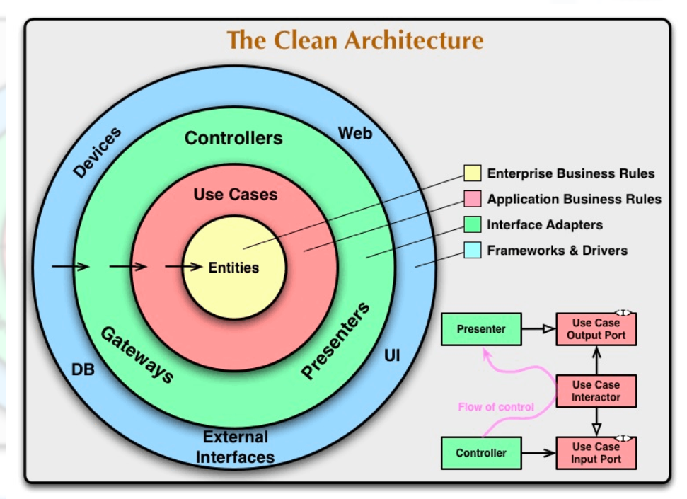

# ginapi-cleanarchi

参考にしているリポジトリ

https://github.com/ryoh07/gin-clean-webapp.git

(クリーンアーキテクチャ参考)[https://qiita.com/ryoh07/items/8ebac006c5294b9b3f58]

## クリーンアーキテクトの図示

## 補足

markdonw のpaste imageがwslでうまく動作しなかったときの対応
https://masa86.net/vscode-paste-image/

dockerの参考にもなる箇所
https://github.com/arkuchy/clean-architecture-sample/tree/main